# Vue2 中的响应式原理

## 流程图



## 思考

> 以 Vue computed 选项式解析

```js
// Test
const app = new Vue({
  data() {
    return {
      msg: '',
    };
  },
  computed: {
    c_msg({ msg }) {
      return msg + ' world';
    },
  },
  render() {
    this.msg = 'hello';
    return this.c_msg;
  },
});
app.$mount('#root');
```

当`data`变化时，`computed`如何监听到变化，更新渲染

## 🕹 小提示

`响应式数据 Vue2 使用 Object.defineProperty`

当一个对象被代理时，解构也能监听变化，如下

```js
let target = { a: 1, b: 2 };
// defineProperty
let keys = Object.keys(target);
for (let i = 0; i < keys.length; i++) {
  let key = keys[i];
  let value = target[key];
  Object.defineProperty(target, key, {
    configurable: true,
    enumerable: true,
    get() {
      console.log('get');
      return value;
    },
    set(newValue) {
      value = newValue;
      target[key] = newValue;
    },
  });
}
// 解构时 targe.a
let { a } = target;
// 输出 get
// proxy
const targetProxy = new Proxy(target, {
  set(o, key, value, receiver) {
    Reflect.set(o, key, value, receiver);
    return true;
  },
  get(o, key, receiver) {
    console.log('proxy get');
    return Reflect.get(o, key, receiver);
  },
});
// 解构时 targetProxy.b
let { b } = targetProxy;
// 输出 proxy get
```

## 发布订阅者模式

`Vue2.x` 中关注 `Dep.target` 属性（当前运行的组件实例）

> 核心组件

- 发布者(Publisher)：负责维护订阅者列表，提供添加、删除订阅者的方法，并在状态改变时通知所有订阅者
- 订阅者(Subscriber)：定义更新接口，当收到发布者通知时执行相应的更新操作
- 事件中心(Event Center)：可选的中介者，管理发布者和订阅者之间的关系



- Observer
  - 定义数据，监听触发变化，通知发布者
- Watcher
  - 添加订阅者
- Dep 发布者
  - 触发订阅者

> 代码实现如下

### Watcher

```js
class Watcher {
  constructor(vm, fn, cb, options) {
    this.vm = vm;

    // lazy 属性用于 computed 使用
    if (options) {
      this.lazy = !!options.lazy;
    } else {
      this.lazy = false;
    }
    this.dirty = this.lazy;

    // 记录发布者
    this.deps = [];
    this.newDeps = [];
    this.depIds = new Set();
    this.newDepIds = new Set();

    // 初始执行函数
    this.fn = fn;
    this.value = this.lazy ? void 0 : this.get();
  }
  get() {
    pushTarget(this);
    let vm = this.vm;
    let value = this.fn.call(vm, vm);
    popTarget();
    this.cleanupDeps();
    return value;
  }
  addDep(dep) {
    let id = dep.id;
    if (!this.newDepIds.has(id)) {
      this.newDepIds.add(id);
      this.newDeps.push(dep);
      if (!this.depIds.has(id)) {
        // 添加订阅者
        dep.addSub(this);
      }
    }
  }
  cleanupDeps() {
    let i = this.deps.length;
    while (i--) {
      let dep = this.deps[i];
      console.log('remove sub', dep.id, !this.newDepIds.has(dep.id));
      if (!this.newDepIds.has(dep.id)) {
        dep.removeSub(this);
      }
    }
    let tmp = this.depIds;
    this.depIds = this.newDepIds;
    this.newDepIds = tmp;
    this.newDepIds.clear();
    tmp = this.deps;
    this.deps = this.newDeps;
    this.newDeps = tmp;
    this.newDeps.length = 0;
  }
  update() {
    if (this.lazy) {
      this.dirty = true;
    } else {
      this.run();
    }
  }
  run() {
    this.value = this.get();
  }
  evaluate() {
    this.value = this.get();
    this.dirty = false;
  }
  depend() {
    let i = this.deps.length;
    console.log('this.deps', this.deps);
    while (i--) {
      this.deps[i].depend();
    }
  }
  // teardown
}
```

### Dep

```js
let uid = 0;
class Dep {
  constructor() {
    this.id = uid++;
    this.subs = [];
  }
  addSub(sub) {
    this.subs.push(sub);
  }
  removeSub(sub) {
    this.subs.splice(this.subs.indexOf(sub), 1);
  }
  depend() {
    if (Dep.target) {
      Dep.target.addDep(this);
    }
  }
  notify() {
    console.log('subs', this.subs);
    for (let i = 0; i < this.subs.length; i++) {
      this.subs[i].update();
    }
  }
}
Dep.target = null;
let stack = [];
function pushTarget(target) {
  stack.push(target);
  Dep.target = target;
}
function popTarget() {
  stack.pop();
  Dep.target = stack[stack.length - 1];
}
```

### 定义响应式数据

`响应式数据定义，并且如何发布消息，订阅者接收，然后执行`

```js
const NOOP = function () {};
const computedWatcherOptions = { lazy: true };
class Vue {
  constructor(options) {
    this.$options = options;
    this.init();
  }
  init() {
    let vm = this;
    let options = this.$options;

    // data
    if (options.data) {
      let data = (vm._data = options.data.call(vm, vm));
      let keys = Object.keys(data);
      let i = keys.length;
      // 借助实例 vm._data 属性来监听实例 data 属性变化
      while (i--) {
        let key = keys[i];
        Object.defineProperty(vm, key, {
          configurable: true,
          enumerable: true,
          get() {
            return vm._data[key];
          },
          set(value) {
            vm._data[key] = value;
          },
        });
      }
      observe(data);
    }

    // computed
    if (options.computed) {
      let computed = options.computed;
      const watchers = (vm._computeWatchers = Object.create(null));
      for (let key in computed) {
        let getter = computed[key];
        watchers[key] = new Watcher(vm, getter, NOOP, computedWatcherOptions);
        Object.defineProperty(vm, key, {
          configurable: true,
          enumerable: true,
          get() {
            let watcher = vm._computeWatchers[key];
            console.log(watcher);
            if (watcher) {
              if (watcher.dirty) {
                watcher.evaluate();
              }
              if (Dep.target) {
                watcher.depend();
              }
            }
            return watcher.value;
          },
          set: NOOP,
        });
      }
    }
  }
  $mount() {
    let vm = this;
    let options = this.$options;
    // 初始渲染函数
    new Watcher(vm, options.render, NOOP);
  }
}
function observe(value) {
  let ob = new Observer(value);
  return ob;
}
class Observer {
  constructor(value) {
    this.value = value;
    // 普通对象
    this.walk(value);
  }
  walk(obj) {
    let keys = Object.keys(obj);
    for (let i = 0; i < keys.length; i++) {
      defineReactive$$1(obj, keys[i]);
    }
  }
}
function defineReactive$$1(obj, key) {
  let dep = new Dep();
  let val = obj[key];
  Object.defineProperty(obj, key, {
    configurable: true,
    enumerable: true,
    get() {
      // 获取值，发布消息
      console.log('Dep.target', Dep.target);
      if (Dep.target) {
        dep.depend();
      }
      return val;
    },
    set(newValue) {
      if (val === newValue) return;
      val = newValue;
      // 值变化了，通知更新
      dep.notify();
    },
  });
}
```

## 参考链接

[完整代码参考](https://github.com/LIUeng/vue-parse/blob/master/src/articles/computed.v2.js)

## END
