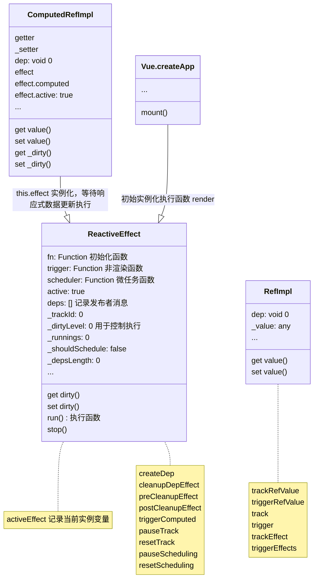
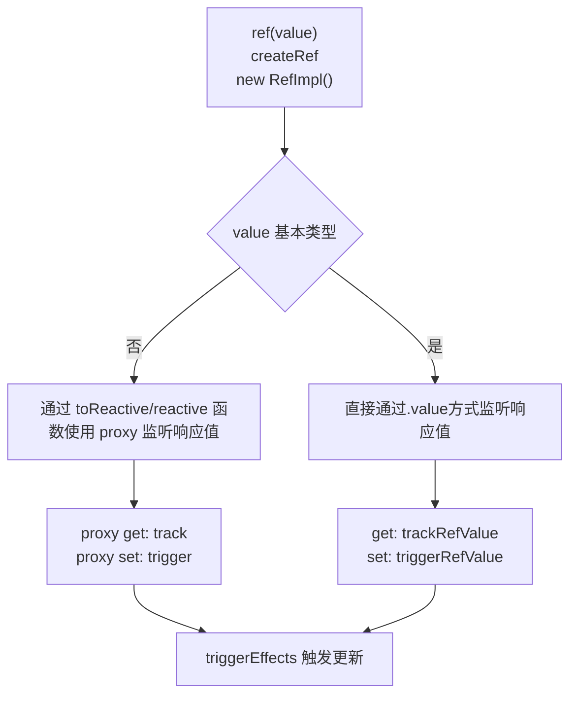
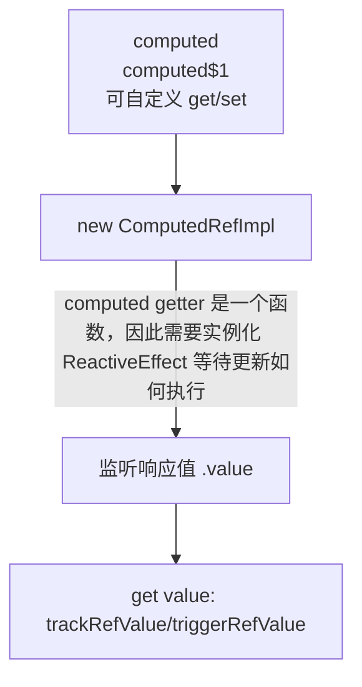

# Vue3 中的响应式原理

## 原理图



## 思考

> 以 Vue 组合式 API(ref computed) 解析

```js
import { ref, computed } from 'vue';
// 响应式数据声明
const msg = ref('');
// 计算属性
const c_msg = computed(() => {
  return msg.value + ' world';
});
// 初始化
const app = Vue.createApp({
  setup() {
    return {
      msg,
      c_msg,
    };
  },
  render() {
    msg.value = 'hello';
    return c_msg.value;
  },
});
// 渲染
app.mount(/* '#root' */);
```

`当响应式数据更新时，computed getter 函数如何执行，并且又是如何触发更新`

## ref

```js
import { ref } from 'vue';
// 普通值
const ref1 = ref(1);
const ref2 = ref('1');
// 对象或者数组
const ref3 = ref({ a: 1 });
const ref4 = ref([1]);
```



### 描述

ref API 每一个响应数据监听都有一个 dep 发布者，等待订阅

- 接收一个参数
- 创建 .value 获取值 ref2 = new RefImpl
  - 基本类型
    - get 获取值 trackRefValue 添加发布者，等待订阅 ref2.dep = createDep
    - set 更新值 triggerValue
  - 引用类型
    - 使用 targetMap = new WeakMap 缓存
      - value 为 key, dep = createDep 为值
    - proxy get 获取值 track 添加发布者，等待订阅
    - proxy set 更新值 trigger
- 触发的条件
  - activeEffect 变量, 当前初始化 ReactiveEffect 实例的渲染函数
- 渲染函数
  - trackEffect 订阅触发
  - triggerEffects
    - \_dirtyLevel 函数参数
      - 0 初始状态
      - 4 ref 值更新

## computed

当定义的响应值触发变化时，触发更新

```js
import { ref, computed } from 'vue';
const count = ref(1);
const plusOne = computed(() => {
  return count.value + 1;
});
// 更新值，触发变化
count.value = 2;
// const plusOne = computed({
//   get: () => count.value + 1,
//   set: (val) => {
//     count.value = val - 1
//   }
// })
// plusOne.value = 1
console.log(count.value); // 0
```



### 描述

computed API 同样也为响应式数据，为每一个 computed 数据实例化添加发布者，等待订阅更新

- 接收 getter/setter 函数参数
  - 实例化 new ComputedRefImpl，创建 .value 值
    - effect = ReactiveEffect 初始化 getter 函数，等待执行
    - 添加发布者 dep
  - 监听变化
    - 触发当前 activeEffect 中的发布者
    - triggerRefValue/triggerEffects
    - 触发 getter 函数执行，获取新值

## 相关函数说明

> trackRefValue 函数

当获取响应式数据 .value 时，会创建发布者并被缓存到当前响应式数据 dep = createDep，因此每个响应式数据都含有 dep 属性

> triggerRefValue 函数

当响应式数据更新值 .value = ? 时，会通知当前的发布者更新消息，执行更新

> track 函数

当响应式数据是非基本类型值时，通过变量 targetMap 创建当前的 dep = createDep

> trackEffect

记录当前更新的响应式数据 dep 并且添加到 ReactiveEffect 实例化 deps 列表中

> trigger 函数

当响应式数据更新时，获取当前的发布者列表，等待执行

> ReactiveEffect \_dirtyLevel 属性

\_dirtyLevel(0 1 2 3 4)属性的作用，通过不同的状态来控制更新

## 测试

### 数据更新

```js
msg.value = 'hello1';
// 触发 render
// 渲染结果 hello1 world
```

### 批量更新

可以看到`ReactiveEffect`类中`scheduler`参数，记录当前需要更新函数的队列，采用`Promise then`微任务方式

```js
const effect = new ReactiveEffect(/* ...,  */ trigger, () => queueJob(update));
const update = () => {
  if (effect.dirty) {
    effect.run();
  }
};
```

```js
msg.value = 'hello1';
msg.value = hello2';
// 多次更新值，只触发一次渲染函数
```

### 附源码实现

从 Vue3 源码中实现部分

```js
(function (exports, factory) {
  exports.Vue = factory();
})(self, function () {
  let shouldTrack = true;
  let activeEffect;
  const NOOP = () => {};
  const trackStack = [];
  let pauseScheduleStack = 0;
  const queueEffectSchedulers = [];
  const isObject = (v) => v != null && typeof v === 'object';

  function queueJob(job) {
    console.log('nextTick wait update');
    Promise.resolve().then(() => {
      job();
    });
  }

  function pauseScheduling() {
    pauseScheduleStack++;
  }
  function resetScheduling() {
    pauseScheduleStack--;
    while (!pauseScheduleStack && queueEffectSchedulers.length) {
      queueEffectSchedulers.shift()();
    }
  }

  function pauseTracking() {
    trackStack.push(shouldTrack);
    shouldTrack = false;
  }
  function resetTracking() {
    const last = trackStack.pop();
    shouldTrack = last === void 0 ? true : last;
  }
  function triggerComputed(computed) {
    return computed.value;
  }
  function preCleanupEffect(effect2) {
    effect2._trackId++;
    effect2._depsLength = 0;
  }
  function postCleanupEffect(effect2) {
    if (effect2.deps.length > effect2._depsLength) {
      for (let i = effect2._depsLength; i < effect2.dep.length; i++) {
        cleanupDepEffect(effect2.deps[i], effect2);
      }
      effect2.deps.length = effect2._depsLength;
    }
  }
  class ReactiveEffect {
    constructor(fn, trigger, scheduler, scope) {
      this.fn = fn;
      this.trigger = trigger;
      this.scheduler = scheduler;
      this.active = true;
      this.deps = [];

      this._trackId = 0;
      this._dirtyLevel = 4;
      this._runnings = 0;
      this._depsLength = 0;
      this._shouldSchedule = false;
    }
    get dirty() {
      if (this._dirtyLevel === 2 || this._dirtyLevel === 3) {
        this._dirtyLevel = 1;
        pauseTracking();
        for (let i = 0; i < this._depsLength; i++) {
          const dep = this.deps[i];
          if (dep.computed) {
            triggerComputed(dep.computed);
            if (this._dirtyLevel >= 4) {
              break;
            }
          }
        }
        if (this._dirtyLevel === 1) {
          this._dirtyLevel = 0;
        }
        resetTracking();
      }
      return this._dirtyLevel >= 4;
    }
    set dirty(v) {
      this._dirtyLevel = v ? 4 : 0;
    }
    run() {
      this._dirtyLevel = 0;
      if (!this.active) {
        return this.fn();
      }
      let lastTrack = shouldTrack;
      let lastEffect = activeEffect;
      try {
        shouldTrack = true;
        activeEffect = this;
        this._runnings++;
        preCleanupEffect(this);
        return this.fn();
      } finally {
        postCleanupEffect(this);
        this._runnings--;
        activeEffect = lastEffect;
        shouldTrack = lastTrack;
      }
    }
    stop() {
      if (this.active) {
        preCleanupEffect(this);
        postCleanupEffect(this);
        this.active = false;
      }
    }
  }

  function createDep(cleanup, computed) {
    const dep = new Map();
    dep.cleanup = cleanup;
    dep.computed = computed;
    return dep;
  }
  function cleanupDepEffect(dep, effect2) {
    const trackId = dep.get(effect2);
    if (trackId !== void 0 && trackId !== effect2.trackId) {
      dep.delete(effect2);
      if (dep.size === 0) {
        dep.cleanup();
      }
    }
  }
  function trackEffect(effect2, dep) {
    if (dep.get(effect2) !== effect2._trackId) {
      dep.set(effect2, effect2._trackId);
      const oldDep = effect2.deps[effect2._depsLength];
      if (oldDep !== dep) {
        // console.log('old dep', oldDep);
        if (oldDep) {
          cleanupDepEffect(oldDep, effect2);
        }
        effect2.deps[effect2._depsLength++] = dep;
      } else {
        effect2._depsLength++;
      }
    }
  }
  function triggerEffects(dep, dirtyLevel) {
    pauseScheduling();
    for (const effect2 of dep.keys()) {
      let tracking;
      if (effect2._dirtyLevel < dirtyLevel && (tracking != null ? tracking : (tracking = dep.get(effect2) === effect2._trackId))) {
        effect2._shouldSchedule || (effect2._shouldSchedule = effect2._dirtyLevel === 0);
        effect2._dirtyLevel = dirtyLevel;
      }
      if (effect2._shouldSchedule && (tracking != null ? tracking : (tracking = dep.get(effect2) === effect2._trackId))) {
        effect2.trigger();
        if (!effect2._runnings && effect2._dirtyLevel !== 2) {
          effect2._shouldSchedule = false;
          if (effect2.scheduler) {
            queueEffectSchedulers.push(effect2.scheduler);
          }
        }
      }
    }
    resetScheduling();
  }

  function trackRefValue(ref2) {
    let _a;
    if (shouldTrack && activeEffect) {
      _a = ref2.dep;
      if (_a != null) {
        _a = _a;
      } else {
        _a = ref2.dep = createDep(() => (ref2.dep = void 0), ref2 instanceof ComputedRefImpl ? ref2 : void 0);
      }
      trackEffect(activeEffect, _a);
    }
  }
  function triggerRefValue(ref2, dirtyLevel, newVal) {
    const dep = ref2.dep;
    if (dep) {
      triggerEffects(dep, dirtyLevel);
    }
  }

  const reactiveMap = new WeakMap();
  const targetMap = new WeakMap();

  function track(target, type, key) {
    if (shouldTrack && activeEffect) {
      let depsMap = targetMap.get(target);
      if (!depsMap) {
        targetMap.set(target, (depsMap = new Map()));
      }
      let dep = depsMap.get(key);
      if (!dep) {
        depsMap.set(key, (dep = createDep(() => depsMap.delete(key))));
      }
      trackEffect(activeEffect, dep);
    }
  }
  function trigger(target, type, key, newValue, oldValue) {
    const depsMap = targetMap.get(target);
    if (!depsMap) {
      return;
    }
    let deps = [];
    if (key !== void 0) {
      deps.push(depsMap.get(key));
    }
    switch (type) {
      case 'set':
        // nothing
        break;
    }
    pauseScheduling();
    for (let dep of deps) {
      if (dep) {
        triggerEffects(dep, 4);
      }
    }
    resetScheduling();
  }

  class BaseReactiveHandler {
    constructor() {}
    get(target, key, receiver) {
      const result = Reflect.get(target, key, receiver);
      // track
      // console.log('proxy get');
      track(target, 'get', key);
      return result;
    }
  }
  class MutableReactiveHandler extends BaseReactiveHandler {
    constructor() {
      super();
    }
    set(target, key, value, receiver) {
      // console.log('proxy set');
      const oldValue = target[key];
      const result = Reflect.set(target, key, value, receiver);
      // add set 这里考虑 set
      if (!Object.is(oldValue, value)) {
        trigger(target, 'set', key, value, oldValue);
      }
      return result;
    }
  }

  function createReactiveObject(target, isReadonly2, baseHandlers, collectionHandlers, proxyMap) {
    const existingProxy = proxyMap.get(target);
    if (existingProxy) {
      return existingProxy;
    }
    const proxy = new Proxy(target, baseHandlers);
    proxyMap.set(target, proxy);
    return proxy;
  }
  function reactive(target) {
    return createReactiveObject(target, false, new MutableReactiveHandler(), {}, reactiveMap);
  }
  function toReactive(value) {
    return isObject(value) ? reactive(value) : value;
  }
  class RefImpl {
    constructor(value, shallow) {
      this.dep = void 0;
      this._rawValue = value;
      this._value = toReactive(value);
      // shallow 不考虑
      // this.shallow = shallow;
    }
    get value() {
      // console.log('get');
      trackRefValue(this);
      return this._value;
    }
    set value(newVal) {
      // console.log('set', newVal, this._rawValue);
      if (Object.is(newVal, this._rawValue)) {
        return;
      }
      this._rawValue = newVal;
      this._value = toReactive(newVal);
      triggerRefValue(this, 4, newVal);
    }
  }
  function createRef(rawValue, shallow) {
    return new RefImpl(rawValue, shallow);
  }
  function ref(value) {
    return createRef(value, false);
  }

  // computed
  class ComputedRefImpl {
    constructor(getter, _setter, isReadonly) {
      this.getter = getter;
      this._setter = _setter;
      this.dep = void 0;
      this.effect = new ReactiveEffect(
        () => getter(this._value),
        () => {
          triggerRefValue(this, this.effect._dirtyLevel === 2 ? 2 : 3);
        }
      );
      this.effect.computed = this;
      this.effect.active = true;
    }
    get value() {
      if (this.effect.dirty && !Object.is(this._value, (this._value = this.effect.run()))) {
        triggerRefValue(this, 4);
      }
      trackRefValue(this);
      if (this.effect._dirtyLevel >= 2) {
        triggerRefValue(this, 2);
      }
      return this._value;
    }
    set value(newVal) {
      this._setter(newVal);
    }
    get _dirty() {
      return this.effect.dirty;
    }
    set _dirty(v) {
      this.effect.dirty = v;
    }
  }
  function computed$1(getterOrOptions) {
    // only getter
    let getter = getterOrOptions;
    const cRef = new ComputedRefImpl(getter, NOOP, true);
    return cRef;
  }
  function computed(getterOrOptions) {
    const c = computed$1(getterOrOptions);
    return c;
  }

  // init
  const createApp = (options) => {
    return {
      mount() {
        if (options.setup) {
          options.setup();
        }
        const effect = new ReactiveEffect(options.render, NOOP, () => queueJob(update));
        const update = () => {
          if (effect.dirty) {
            effect.run();
          }
        };
        update();
      },
    };
  };

  return {
    ref,
    computed,
    createApp,
  };
});
```

## 相关链接

[代码实现](https://github.com/LIUeng/vue-parse/blob/master/src/articles/reactive.v3.js)

## END
