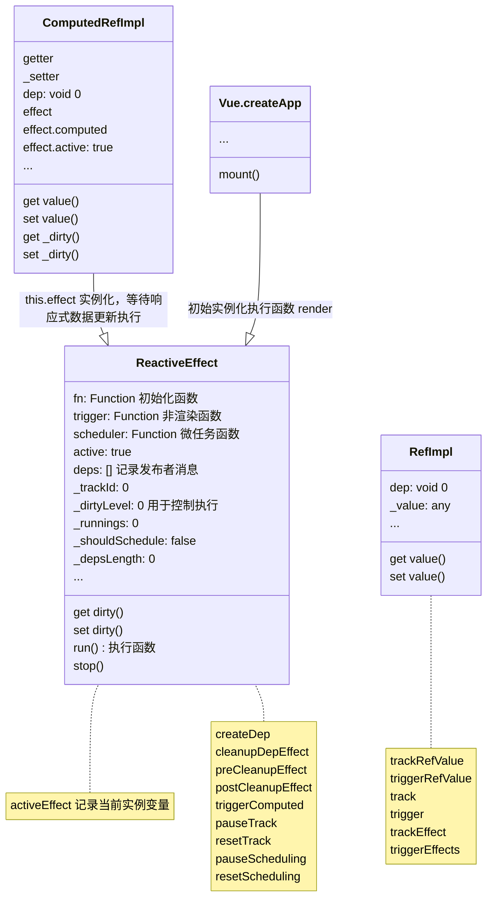
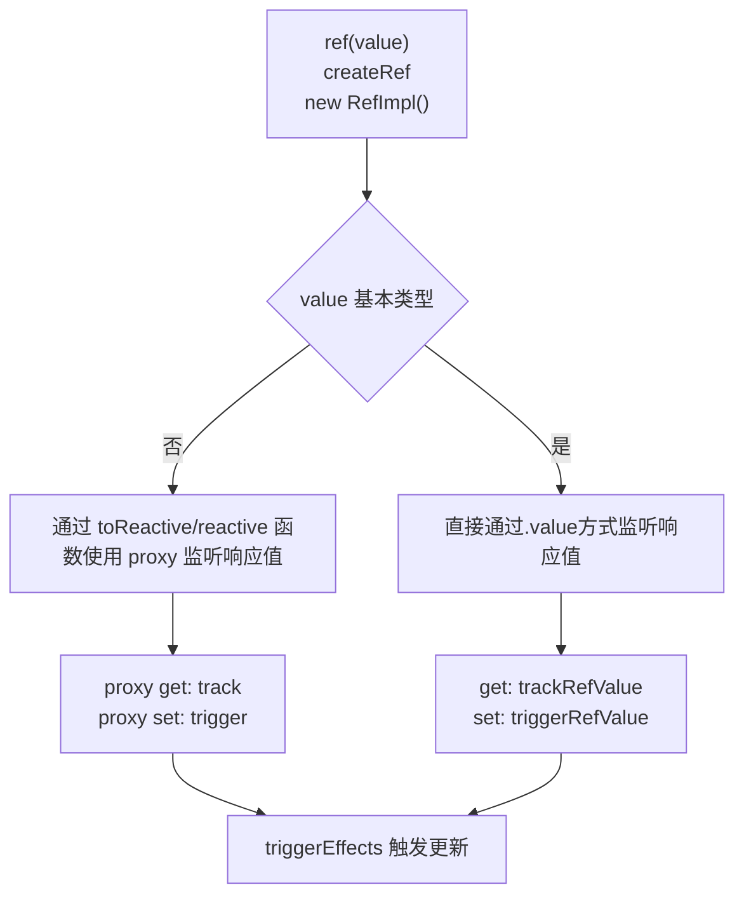
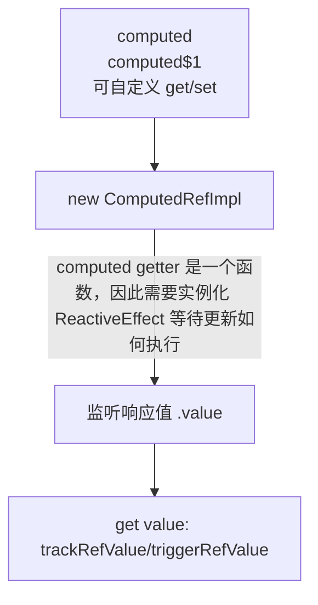

# Vue3 Reactive

## Principle



## ref

```js
import { ref } from 'vue';
// 普通值
const ref1 = ref(1);
const ref2 = ref('1');
// 对象或者数组
const ref3 = ref({ a: 1 });
const ref4 = ref([1]);
```



### Description

ref API 每一个响应数据监听都有一个 dep 发布者，等待订阅

- 接收一个参数
- 创建 .value 获取值 ref2 = new RefImpl
  - 基本类型
    - get 获取值 trackRefValue 添加发布者，等待订阅 ref2.dep = createDep
    - set 更新值 triggerValue
  - 引用类型
    - 使用 targetMap = new WeakMap 缓存
      - value 为 key, dep = createDep 为值
    - proxy get 获取值 track 添加发布者，等待订阅
    - proxy set 更新值 trigger
- 触发的条件
  - activeEffect 变量, 当前初始化 ReactiveEffect 实例的渲染函数
- 渲染函数
  - trackEffect 订阅触发
  - triggerEffects
    - \_dirtyLevel 函数参数
      - 0 初始状态
      - 4 ref 值更新

## computed

当定义的响应值触发变化时，触发更新

```js
import { ref, computed } from 'vue';
const count = ref(1);
const plusOne = computed(() => {
  return count.value + 1;
});
// 更新值，触发变化
count.value = 2;
// const plusOne = computed({
//   get: () => count.value + 1,
//   set: (val) => {
//     count.value = val - 1
//   }
// })
// plusOne.value = 1
console.log(count.value); // 0
```



### Description

computed API 同样也为响应式数据，为每一个 computed 数据实例化添加发布者，等待订阅更新

- 接收 getter/setter 函数参数
  - 实例化 new ComputedRefImpl，创建 .value 值
    - effect = ReactiveEffect 初始化 getter 函数，等待执行
    - 添加发布者 dep
  - 监听变化
    - 触发当前 activeEffect 中的发布者
    - triggerRefValue/triggerEffects
    - 触发 getter 函数执行，获取新值

## 解释

> trackRefValue 函数

当获取响应式数据 .value 时，会创建发布者并被缓存到当前响应式数据 dep = createDep，因此每个响应式数据都含有 dep 属性

> triggerRefValue 函数

当响应式数据更新值 .value = ? 时，会通知当前的发布者更新消息，执行更新

> track 函数

当响应式数据是非基本类型值时，通过变量 targetMap 创建当前的 dep = createDep

> trackEffect

记录当前更新的响应式数据 dep 并且添加到 ReactiveEffect 实例化 deps 列表中

> trigger 函数

当响应式数据更新时，获取当前的发布者列表，等待执行

> ReactiveEffect \_dirtyLevel 属性

\_dirtyLevel(0 1 2 3 4)属性的作用，通过不同的状态来控制更新
